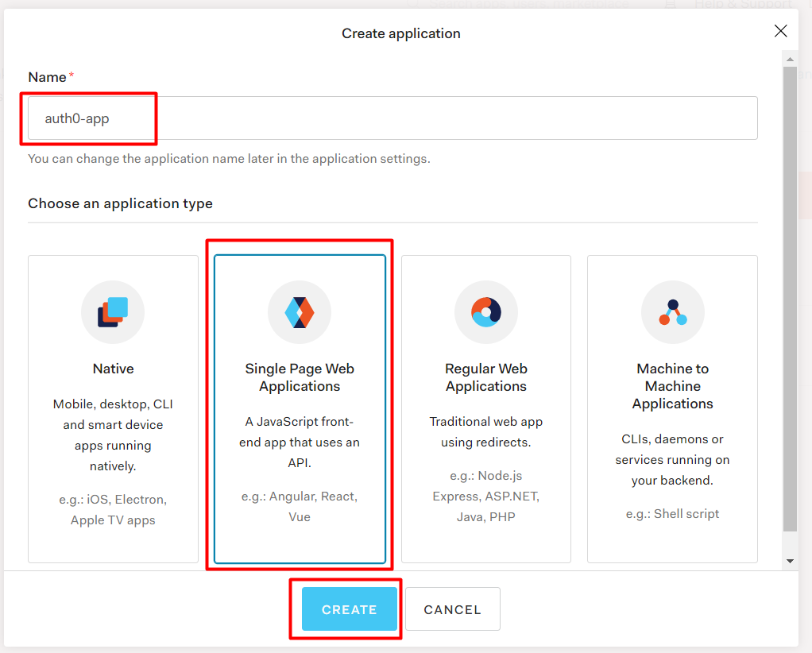
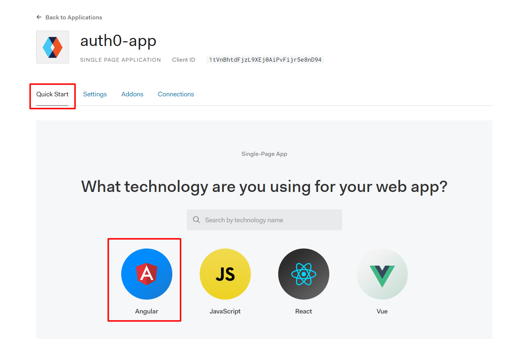
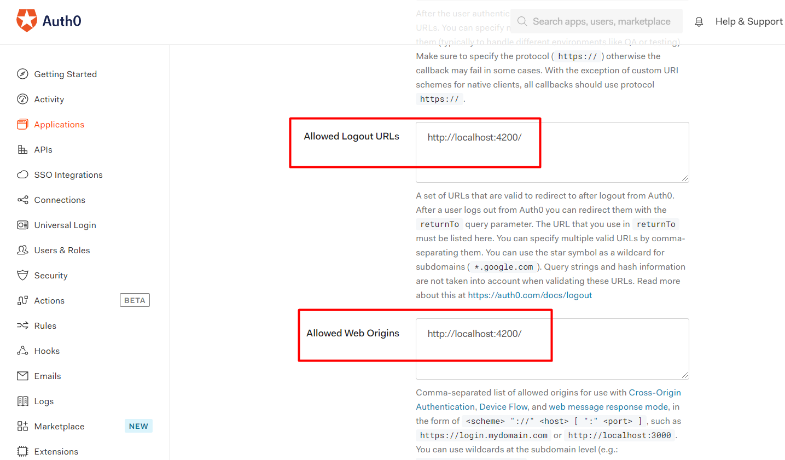
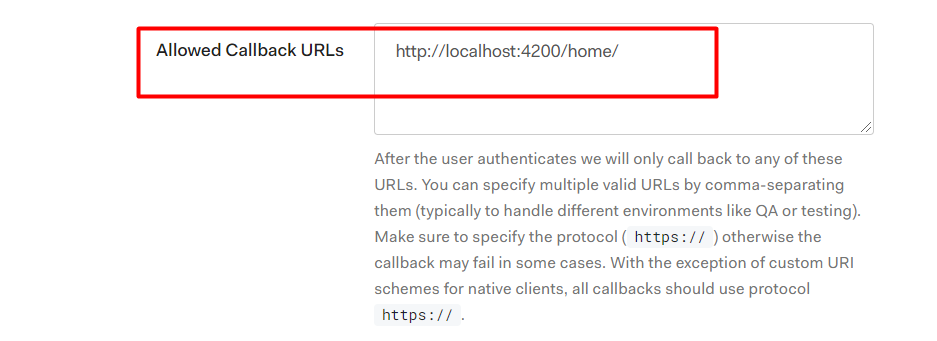
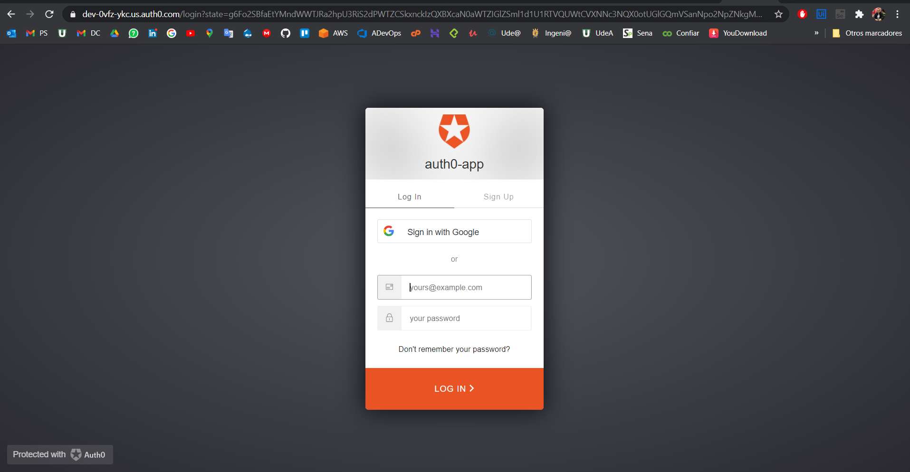
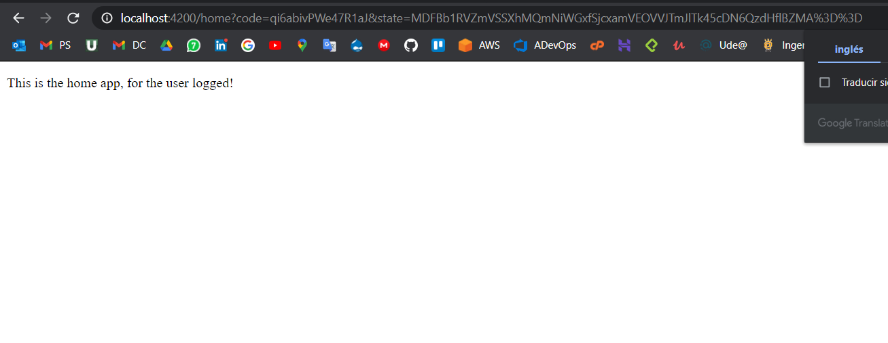

# angular-auth0
step to step for implementation of Auth0 in Angular

## Implementation

1. sign in for `https://auth0.com/`

2. create a Application of type SPA (Single Page Application)



3. Follow the steps for `Quick Start` or Follow Configuration




## Configuration

1. go to Settings and modify  `Allowed Logout URLs`, `Allowed Web Origins` with: 
```
http://localhost:4200/
```



-  In settings modify the part `Allowed Callback URLs` with:
```
http://localhost:4200/home/
```



> Clic to Save Changes


2. Install the Auth0 Angular SDK
```
npm install @auth0/auth0-angular
```


- In app.module.ts stays like this:
```ts
import { BrowserModule } from '@angular/platform-browser';
import { NgModule } from '@angular/core';
import { AppRoutingModule } from './app-routing.module';
import { AppComponent } from './app.component';

//Import for the Auth0
import { AuthModule } from '@auth0/auth0-angular';
import { LoginComponent } from './components/login/login.component';
import { HomeComponent } from './components/home/home.component';

@NgModule({
  declarations: [
    AppComponent,
    LoginComponent,
    HomeComponent
  ],
  imports: [
    BrowserModule,
    AppRoutingModule,
    // Import the module into the application, with configuration
    AuthModule.forRoot({
      domain: 'dev-0vfz-ykc.us.auth0.com',
      clientId: '1tVnBhtdFjzL9XEj0AiPvFijr5e8nD94',
      redirect_uri: 'http://localhost:4200/home/'
    }),
  ],
  providers: [],
  bootstrap: [AppComponent]
})
export class AppModule { }
```
> NOTE: the `domain` and `clientId` is in Quick Start of Auth0 Application

> NOTE: the redirect_uri is equal to Allowed Callback URLs

## Create the Login Component

- To create component login 
```
ng g component components/login
```

- Modify the login.component.ts with:
```ts
import { Component, OnInit } from '@angular/core';
// Import the AuthService type from the SDK
import { AuthService } from '@auth0/auth0-angular';

@Component({
  selector: 'app-login',
  templateUrl: './login.component.html'
})
export class LoginComponent implements OnInit {
  //create auth in constructor
  constructor(public auth: AuthService) { }

  ngOnInit(): void {
    //when call the component login, open the auth0
    this.auth.loginWithRedirect()
  }
}
```
> The rest of files: `login.component.html`, `login.component.css`, `login.component.spec` it is to delete


- Create component for user logged

 this the component that open when user is logged
```
ng g component components/home
```

- add the label `<p>` in home.component.html
```html
<p>This is the home app, for the user logged!</p>
```

- add in the app.routing.module.ts
```ts
const routes: Routes = [
  {
    path: 'login',
    component: LoginComponent,
  },
  {
    path: 'home',
    component: HomeComponent,
  },
  { path: '', redirectTo: 'login', pathMatch: 'full' },
  { path: '**', redirectTo: 'login' }
];
```

## Execution
Execution command: `ng serve -o`


## Result Execution
Login


Home


